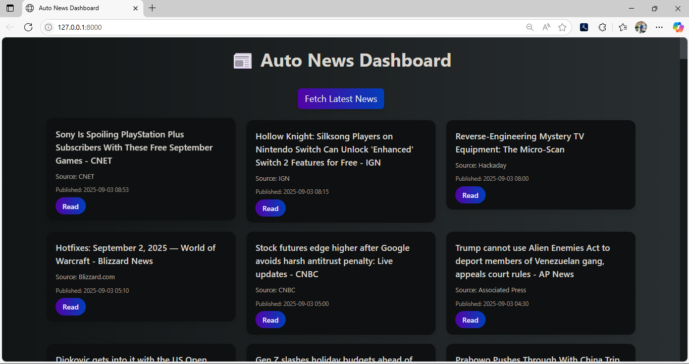
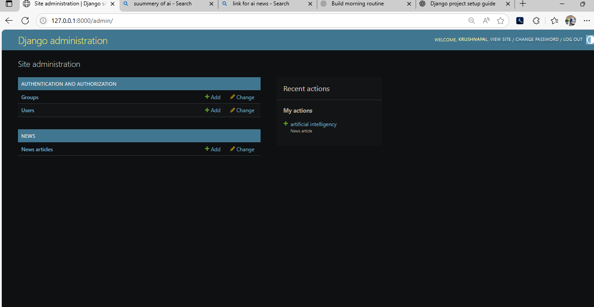
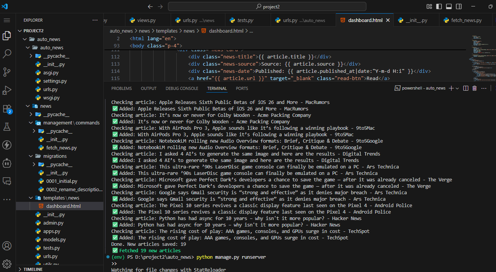

📰 Auto News Aggregator

A Django-based web application that automatically fetches and stores the latest news articles from NewsAPI, displays them in a dashboard, and can refresh articles automatically via cron jobs or Windows Task Scheduler.

📌 Features

Fetch latest news from NewsAPI

Prevent duplicate articles using unique title & URL

Store news in SQLite database

Admin panel for managing news

Dashboard to view articles

Manual fetch button on dashboard

Automatic scheduling (every 5 minutes / hourly)

🛠️ Tech Stack

Backend: Django (Python)

Database: SQLite

Frontend: Django Templates + Bootstrap (customizable)

APIs: NewsAPI

Scheduler:

Linux/macOS → django-crontab

Windows → Task Scheduler

⚙️ Installation

Clone the repository

git clone https://github.com/KRUSHNAPALSINHH/autonews_django_project.git
cd auto-news

Create virtual environment & install dependencies

python -m venv venv
source venv/bin/activate  # macOS/Linux
venv\Scripts\activate     # Windows

pip install -r requirements.txt

Set up environment variables
Create a .env file in your project root:

NEWS_API_KEY=your_api_key_here

Apply migrations

python manage.py migrate

Run development server

python manage.py runserver

🚀 Usage
1. Fetch News (Manual Command)
python manage.py fetch_news

✅ Output example:

API Status: ok
Total Results: 35
Articles Returned: 15
✅ Added: AI stethoscope could detect heart conditions in seconds
⚠️ Skipped duplicate: https://www.bbc.com/news/articles/xyz
Done. New articles saved: 5
Fetched 5 new articles

2. Dashboard View

Visit:

http://127.0.0.1:8000/

📷 Example Screenshot:

3. Admin Panel
http://127.0.0.1:8000/admin/

📷 Example Screenshot:

4. Automatic Scheduling

Windows (via Task Scheduler)
Open Task Scheduler
Create Basic Task → Run every 30 minutes

Action:

python manage.py fetch_news

📂 Project Structure
auto_news/
│── auto_news/
│   ├── settings.py
│   ├── urls.py
│   └── wsgi.py
│
│── news/
│   ├── models.py      # NewsArticle model
│   ├── utils.py       # Fetch & store news logic
│   ├── views.py       # Dashboard + fetch view
│   ├── admin.py       # Register NewsArticle in admin
│   ├── management/commands/fetch_news.py  # Custom command
│   └── templates/news/dashboard.html
│
│── db.sqlite3
│── manage.py
│── requirements.txt
│── .env
│── README.md

## 🖼 Example Screenshots  
📷 **Dashboard Page:**  

📷 **Admin Panel:**  

📷 **Console Output (fetch_news):**  
 

---

👨‍💻 Author

Built with ❤️ using Django & NewsAPI.